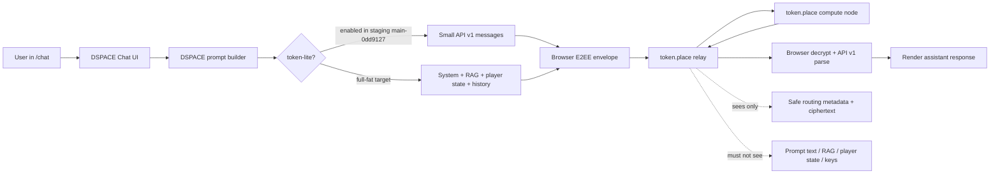
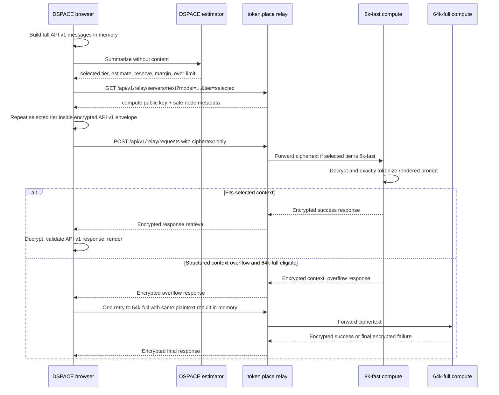

# DSPACE token.place context tiers design

## Purpose

This document defines DSPACE's side of benchmarking, estimating, routing, and validating
full-fat DSPACE chat through token.place API v1 context tiers. It is a planning contract for the
P4-P13 implementation sequence and is intentionally documentation-only.

DSPACE staging `main-0dd9127` successfully completed token.place API v1 end-to-end encrypted
(E2EE) chat with token-lite enabled. That staging result proves the DSPACE request construction,
relay selection, encryption, token.place compute processing, response retrieval, decryption,
API v1 parsing, and UI rendering path works for a small prompt. The remaining blocker is context
capacity and workload routing for full-fat prompts that include system instructions, retrieved
DSPACE knowledge, player state, and chat history.

## Non-goals

- Do not design token.place API v2.
- Do not add API v1 streaming; API v1 remains non-streaming for this design.
- Do not weaken the relay-blind E2EE invariant by exposing prompt text, RAG excerpts, player
  state, ciphertext, keys, or decrypted responses to relay-visible logs or metadata.
- Do not implement automatic silent truncation after compute-side context rejection.
- Do not commit benchmark outputs that contain user content.
- Do not make DSPACE authoritative for exact admission. The compute node remains authoritative
  after decrypting and exactly tokenizing the rendered prompt.
- Do not require a token.place API key or OpenAI key for the default token.place path.

## Current-state architecture



Current DSPACE-side limits are:

| Limit                        |      Current value | Context-tier implication                                       |
| ---------------------------- | -----------------: | -------------------------------------------------------------- |
| API v1 message count         |        64 messages | Message count is bounded but not enough to prove token fit.    |
| Per-message content length   |  32,768 characters | A single large message can exceed an 8K tier.                  |
| Total message-content length | 131,072 characters | Roughly 32K tokens by the four-characters-per-token heuristic. |

The 131,072-character ceiling is only a conservative character guard. It is roughly 32K tokens
under the common four-characters-per-token heuristic, but it is not an exact tokenizer result and
it does not include chat-template overhead or output-token reservation.

## Initial tier model

| Tier ID    | Total context tokens | Intended use               | Expected initial operator profile                   |
| ---------- | -------------------: | -------------------------- | --------------------------------------------------- |
| `8k-fast`  |                8,192 | token-lite and small chats | Mac Mini M4 Pro with 24 GB unified memory           |
| `64k-full` |               65,536 | full-fat DSPACE prompts    | Windows PC with RTX 4090 24 GB VRAM and 128 GB DDR5 |

DSPACE should prefer the smallest tier likely to satisfy the request. token-lite should normally
fit `8k-fast`; full-fat prompts may require `64k-full`.

## DSPACE and token.place responsibility split

| Area                | DSPACE responsibility                                                                           | token.place responsibility                                                       |
| ------------------- | ----------------------------------------------------------------------------------------------- | -------------------------------------------------------------------------------- |
| Prompt construction | Build API v1 `messages` from system instructions, RAG, player state, and history.               | Do not construct DSPACE-specific prompts.                                        |
| Prompt measurement  | Count messages, characters, bytes, estimated tokens, components, and durations without content. | Optionally expose safe diagnostics for compute admission and execution.          |
| Tier estimate       | Browser-safe conservative estimate, output reservation, safety margin, selected tier.           | Advertise derived tier capabilities and enforce exact context after decryption.  |
| Routing             | Request a node compatible with model and required tier.                                         | Relay filters eligible nodes without seeing prompt text.                         |
| Privacy             | Keep plaintext and exact tokenizer detail out of relay-visible metadata.                        | Keep relay state/logs ciphertext-only plus safe routing metadata.                |
| Admission           | Preflight estimate and bounded retry policy.                                                    | Exact tokenizer admission control after decrypting rendered prompt.              |
| Failures            | Surface over-limit and retry/escalation behavior in the UI.                                     | Return structured encrypted context-overflow details when exact admission fails. |

## Proposed request sequence



Relay-visible routing information must remain coarse and privacy-safe. The relay may receive tier
IDs, model IDs, request IDs, queue metadata, and aggregate sizes if needed for routing, but must
not receive prompt text, exact tokenized content, RAG excerpts, player state, keys, ciphertext
contents, or decrypted responses.

## Phase roadmap

### Phase 0: Measurement and instrumentation

Goal: measure real DSPACE prompt composition without recording prompt text.

DSPACE should capture:

- Message count.
- Character count.
- UTF-8 byte count.
- Estimated tokens.
- Component-level contribution, for example system instructions, RAG, player state, chat history,
  and user input.
- Prompt-build time.
- RAG time.
- Encryption time.
- Queue/retrieval time.
- End-to-end latency.

Representative benchmark scenarios:

1. token-lite baseline.
2. Minimal new-game state.
3. Typical mid-game state.
4. RAG-heavy state.
5. Long chat history.
6. Large player-state payload.
7. Near-DSPACE API character ceiling.

Benchmark outputs should be local JSON and Markdown files, generated from synthetic or
repository-deterministic fixtures. They must not be committed if they include user content. If
committed fixtures are needed, they must be synthetic and free of secrets, player personal data,
raw chat transcripts, and private save data.

### Phase 1: Two static physical tiers

Goal: ship the simplest useful capacity split.

- Mac Mini M4 Pro with 24 GB unified memory targets `8k-fast`.
- Windows PC with RTX 4090 24 GB VRAM and 128 GB DDR5 targets `64k-full`.
- Context tier is selected manually before starting the token.place operator.
- A compute node warms exactly one selected tier before registration.
- Switching tiers requires stopping the operator, changing the tier, warming the new runtime, and
  re-registering.
- DSPACE estimates a tier before selecting a node.
- Compute nodes enforce the exact context budget after decryption.
- A structured encrypted overflow error may trigger one retry from `8k-fast` to `64k-full`.

### Phase 2: Capability-aware and load-aware routing

Goal: replace blind or coarse selection with a capability-aware scheduler.

- Nodes advertise derived service capabilities rather than raw hardware identity.
- Relay selection filters by model and required context tier.
- The scheduler prefers the smallest capable tier, then the least-loaded node.
- Queue depth, in-flight work, and max concurrency influence selection.
- Small work may spill to a larger tier only when no smaller eligible node is available.

### Phase 3: Runtime optimization

Goal: empirically tune runtime settings and capacity.

Benchmark:

- Flash attention.
- f16, q8, and q4 KV cache.
- `offload_kqv`.
- `n_batch` and `n_ubatch`.
- Prompt caching.
- Backend-specific behavior.

Track:

- Memory usage.
- Prefill throughput.
- Decode throughput.
- Time to first token or first response.
- Total latency.
- Output quality.

Google AI summaries, vendor claims, and rule-of-thumb memory estimates are not sufficient for
admission. They may inform planning but must not replace exact tokenizer admission and empirical
runtime measurement. Planning estimate: a 64K f16 KV cache for Llama 3.1 8B GQA may consume
roughly 8 GB before model weights and runtime buffers, but this requires empirical verification on
the selected runtime and hardware.

### Phase 4: Same-device multi-tier research

Goal: investigate better utilization after static tiers are proven.

Future investigations:

- Multiple high-level `Llama` instances.
- One shared model with multiple low-level llama.cpp contexts.
- `llama-server` sidecar with slots, continuous batching, prompt caching, metrics, and
  speculative decoding.
- Dynamic tier switching or eviction based on available memory.

These are not part of the initial implementation.

## DSPACE-side contract

DSPACE should produce a deterministic prompt summary that never contains user content.

```ts
type DspacePromptSummary = {
  schemaVersion: 1;
  requestId: string;
  provider: 'token.place';
  apiVersion: 'v1';
  model: string;
  mode: 'token-lite' | 'full-fat';
  messageCount: number;
  contentCharacters: number;
  utf8Bytes: number;
  components: Array<{
    id:
      | 'system'
      | 'rag'
      | 'player-state'
      | 'chat-history'
      | 'user-input'
      | 'other';
    messageCount: number;
    contentCharacters: number;
    utf8Bytes: number;
    estimatedTokens: number;
  }>;
};
```

DSPACE tier classification should include:

```ts
type DspaceTierClassification = {
  selectedTier: '8k-fast' | '64k-full' | 'over-limit';
  estimatedPromptTokens: number;
  reservedOutputTokens: number;
  safetyMarginTokens: number;
  estimatedTotalContextUse: number;
  overLimit: boolean;
  overLimitReason?:
    | 'dspace-character-ceiling'
    | 'tier-capacity'
    | 'message-count';
};
```

Required behavior:

- Use a browser-safe conservative token estimate.
- Include output-token reservation and a safety margin before selecting a tier.
- Select a tier-aware server before dispatching ciphertext.
- Repeat the selected tier inside the encrypted API v1 request so the compute node can verify the
  routing contract after decryption.
- Use context-aware polling deadlines because 64K prefill can take longer than token-lite.
- Retry at most once, and only for a structured encrypted context-overflow response.
- Do not automatically retry policy, network, malformed-response, provider, or general failures.
- Do not silently truncate after compute-side rejection unless a later design explicitly defines
  truncation and surfaces it to the user.

## Benchmark schema

Local JSON benchmark output should use a content-free schema such as:

```json
{
  "schemaVersion": 1,
  "createdAt": "2026-06-22T00:00:00.000Z",
  "gitRevision": "main-0dd9127-or-local-revision",
  "scenario": "rag-heavy-state",
  "mode": "full-fat",
  "model": "llama-3.1-8b-instruct",
  "promptSummary": {
    "messageCount": 12,
    "contentCharacters": 42000,
    "utf8Bytes": 43500,
    "estimatedTokens": 12000,
    "components": [
      {
        "id": "rag",
        "messageCount": 3,
        "contentCharacters": 25000,
        "utf8Bytes": 26000,
        "estimatedTokens": 7200
      }
    ]
  },
  "tierClassification": {
    "selectedTier": "64k-full",
    "estimatedPromptTokens": 12000,
    "reservedOutputTokens": 1024,
    "safetyMarginTokens": 1024,
    "estimatedTotalContextUse": 14048,
    "overLimit": false
  },
  "durationsMs": {
    "promptBuild": 20,
    "rag": 45,
    "encryption": 8,
    "queueAndRetrieval": 900,
    "endToEnd": 1300
  },
  "privacy": {
    "containsPromptText": false,
    "containsRagExcerpt": false,
    "containsPlayerState": false,
    "containsCiphertext": false,
    "containsDecryptedResponse": false
  }
}
```

Markdown benchmark output should summarize the same data in aggregate tables only, with no prompt
text or excerpts.

## Tier-selection decision table

| Estimate state                                             | Eligible tiers                        | DSPACE selection                         | Retry behavior                                                                 |
| ---------------------------------------------------------- | ------------------------------------- | ---------------------------------------- | ------------------------------------------------------------------------------ |
| token-lite estimate fits `8k-fast` with reserve and margin | `8k-fast`, `64k-full`                 | `8k-fast`                                | One retry to `64k-full` only on encrypted context overflow.                    |
| full-fat estimate exceeds `8k-fast` but fits `64k-full`    | `64k-full`                            | `64k-full`                               | No tier escalation remains; surface structured overflow if rejected.           |
| estimate exceeds `64k-full`                                | none                                  | `over-limit`                             | Do not dispatch; ask user to reduce context or use future truncation workflow. |
| estimate fits `8k-fast`, but no `8k-fast` node available   | `64k-full` if policy allows spillover | `64k-full`                               | No further escalation.                                                         |
| message count or DSPACE character ceiling exceeded         | none                                  | `over-limit`                             | Do not dispatch.                                                               |
| exact compute tokenizer rejects estimated-fit request      | larger tier if original was `8k-fast` | Retry once to `64k-full`; otherwise fail | Bounded to one structured overflow retry.                                      |

## Failure-mode table

| Failure                                              | Source                       | Automatic retry?                                                                  | User/telemetry behavior                                   |
| ---------------------------------------------------- | ---------------------------- | --------------------------------------------------------------------------------- | --------------------------------------------------------- |
| Structured context overflow on `8k-fast`             | Encrypted compute response   | Yes, once to `64k-full`                                                           | Safe error code and retry count only.                     |
| Structured context overflow on `64k-full`            | Encrypted compute response   | No                                                                                | Surface over-limit; do not truncate silently.             |
| DSPACE estimator over-limit                          | Browser preflight            | No                                                                                | Do not dispatch ciphertext; show reduce-context guidance. |
| Policy rejection                                     | token.place compute/provider | No                                                                                | Surface policy-safe message and safe error code.          |
| Network failure                                      | Browser/relay path           | No automatic tier retry                                                           | Surface connectivity error.                               |
| Malformed encrypted response or API v1 parse failure | Browser validation           | No                                                                                | Surface provider-response error; log safe code only.      |
| Relay has no eligible node                           | Relay selection              | No tier retry unless larger-tier spillover is explicitly selected before dispatch | Surface capacity message.                                 |
| Timeout                                              | Queue/retrieval              | No automatic tier retry                                                           | Use context-aware deadline and safe timeout code.         |
| User abort                                           | Browser                      | No                                                                                | Cancel/poll cleanup if supported; no retry.               |

## Privacy and observability requirements

Never log:

- Message text.
- RAG excerpts.
- Player state.
- Keys.
- Ciphertext.
- Decrypted responses.
- Raw save data, inventory details, or personal data.

Telemetry may contain:

- Counts.
- Durations.
- Tier IDs.
- Safe error codes.
- Request IDs when they are not linkable to prompt contents beyond normal request correlation.
- Aggregate sizes.

Production instrumentation must be opt-in or emitted only through existing privacy-safe
diagnostics. Benchmark fixtures must be synthetic or deterministic repository fixtures.

## Acceptance and testing strategy

- Unit tests for estimator boundaries and tier selection.
- Unit tests for UTF-8, code-heavy, JSON-heavy, whitespace-heavy, and long-RAG inputs.
- E2E tests with mocked `8k-fast` and `64k-full` compute-node responses.
- Staging validation for token-lite on `8k-fast` and full-fat chat on `64k-full`.
- Verification that relay-visible requests remain ciphertext-only plus coarse safe routing data.
- Verification that retry is bounded to one tier escalation.

## Rollout plan

1. Land measurement and benchmark tooling disabled by default.
2. Collect synthetic and staging-safe benchmark data for token-lite and full-fat scenarios.
3. Enable static `8k-fast` and `64k-full` tier registration in token.place operators.
4. Add DSPACE estimator and tier-aware server selection behind a feature flag or staged rollout.
5. Validate token-lite on `8k-fast` in staging.
6. Validate full-fat DSPACE chat on `64k-full` in staging.
7. Enable bounded context-overflow retry from `8k-fast` to `64k-full`.
8. Promote after privacy checks confirm relay-visible requests remain ciphertext-only.

## Rollback plan

- Disable full-fat token.place routing and return to token-lite if full-fat capacity is unstable.
- Disable bounded tier retry if it increases latency or failure amplification.
- Pin DSPACE to `64k-full` only if estimator under-selection causes frequent 8K overflow.
- Pin DSPACE to `8k-fast` token-lite only if 64K operators are unavailable.
- Keep OpenAI opt-in settings unaffected; do not make OpenAI the default rollback path for this
  tiering work.

## Open questions

- What exact safety margin should DSPACE use per model and tier before empirical data exists?
- What output-token reservation should be used for token-lite, normal chat, and long-answer modes?
- Should relay-visible aggregate byte counts be included in routing metadata, or are tier ID and
  model sufficient?
- What structured encrypted error shape should represent exact tokenizer overflow?
- How should DSPACE display user-facing reduce-context guidance without exposing internals?
- What staging evidence format should be required before enabling 64K full-fat prompts by default?
- How should request IDs be rotated or scoped to avoid unintended cross-system correlation?

## Future work

- Exact browser tokenizer for DSPACE-side estimates.
- `llama-server` sidecar evaluation.
- Multiple warm contexts on one operator host.
- Shared-model contexts with multiple llama.cpp contexts.
- Dynamic memory-aware tier selection and eviction.
- Advanced scheduling across tiers, queues, and model variants.
- Prompt caching for stable DSPACE system and RAG prefixes.
- Speculative decoding.
- API v2 streaming design in a separate document when token.place API v2 is intentionally in
  scope.

## Repository references verified for this design

- Existing token.place chat integration planning: `docs/design/token-place-chat-v3.1.md`.
- token.place QA route and privacy expectations: `docs/qa/v3.1.md`.
- Runtime token.place configuration names: `docs/config.md`.
- Route documentation for `/chat`: `docs/ROUTES.md`.
