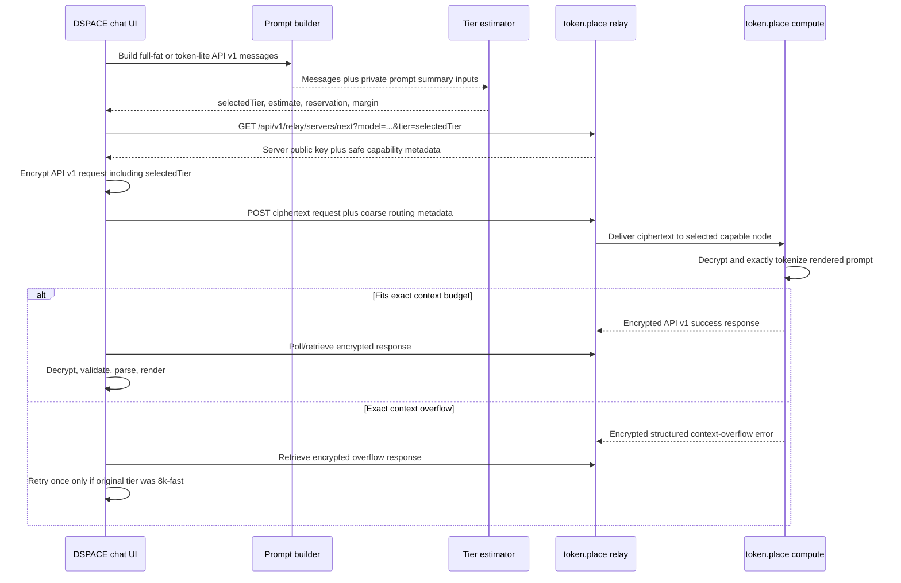

# DSPACE token.place Context Tier Design

## Purpose

This document defines DSPACE's responsibilities for benchmarking, estimating, routing, and
validating full-fat DSPACE chat requests through token.place API v1 context tiers. It is a
planning document for the P6-P13 implementation sequence and does not change production behavior.

DSPACE staging `main-0dd9127` successfully completed token.place API v1 E2EE chat with token-lite
enabled. That staging pass proves the current end-to-end path for a small request: DSPACE request
construction, relay selection, browser-side encryption, token.place compute processing, response
retrieval, browser-side decryption, API v1 response parsing, and UI rendering. The remaining
blocker is context capacity and workload routing for full-fat DSPACE prompts containing system
instructions, RAG context, player state, and chat history.

This document is intentionally DSPACE-specific. token.place owns operator lifecycle, capability
registration, relay scheduling, compute-side exact tokenization, admission control, model runtime
selection, and service health. DSPACE owns prompt summarization, conservative browser-side
estimation, tier classification before relay selection, privacy-safe instrumentation, retry policy,
and user-facing behavior when capacity is insufficient.

## Non-goals

- Do not design or modify token.place API v2.
- Do not add API v1 streaming; API v1 remains non-streaming for this plan.
- Do not change application code, tests, package dependencies, generated files, or API behavior in
  this documentation-only phase.
- Do not expose DSPACE prompt text, RAG excerpts, player state, keys, ciphertext, or decrypted
  responses in telemetry.
- Do not treat DSPACE's browser estimate as authoritative admission.
- Do not silently truncate after compute-side context rejection unless a later design explicitly
  defines and surfaces that behavior to the user.
- Do not encode raw hardware identity into relay-visible routing metadata. DSPACE should request a
  service capability tier, not a named operator machine.

## Current-state references

The current DSPACE token.place API v1 implementation already defines the key API v1 shaping limits
and E2EE relay constants in `frontend/src/utils/tokenPlace.js`:

- Maximum API v1 messages: `TOKEN_PLACE_API_V1_MAX_MESSAGES = 64`.
- Maximum characters per message content: `TOKEN_PLACE_API_V1_MAX_MESSAGE_CONTENT_CHARS = 32_768`.
- Maximum total message-content characters: `TOKEN_PLACE_API_V1_MAX_TOTAL_CONTENT_CHARS = 131_072`.
- Default model: `llama-3.1-8b-instruct`.
- Relay protocol envelope: `tokenplace_api_v1_relay_e2ee`, version `1`.

The current full-fat chat path reuses DSPACE's prompt-building pipeline and then sends an API v1
request inside the encrypted relay envelope. The token-lite path intentionally builds a tiny
system/user pair and skips RAG/player-state expansion.

The 131,072-character DSPACE API v1 content ceiling is roughly 32K tokens under the common
four-characters-per-token heuristic. That is only a rough planning estimate. It is not an exact
model tokenizer result, does not include chat-template overhead, and does not reserve output
tokens. The compute node remains the authoritative admission controller after decrypting and
exactly tokenizing the rendered prompt.

## Current-state architecture

```mermaid
flowchart LR
    Browser[DSPACE browser chat UI]
    Prompt[DSPACE prompt builder\nfull-fat or token-lite]
    Estimate[No context-tier estimate yet]
    RelaySelect[token.place relay\nnext server]
    Encrypt[Browser encrypts API v1 envelope]
    Relay[token.place relay\nciphertext queue]
    Compute[token.place compute node\ndecrypts and runs model]
    Response[Encrypted API v1 response]
    UI[DSPACE decrypts, parses, renders]

    Browser --> Prompt --> Estimate --> RelaySelect --> Encrypt --> Relay --> Compute --> Response --> UI
```



Current token-lite staging validation demonstrates that the basic E2EE request/response path works.
The missing architecture element is a privacy-safe capacity signal that lets DSPACE prefer an
appropriate context tier before choosing a node.

## Target context tiers

Initial token.place profiles are two static physical tiers:

| Tier ID | Total context tokens | DSPACE expectation | Initial operator target |
| --- | ---: | --- | --- |
| `8k-fast` | 8,192 | token-lite and small prompts should normally fit | Mac Mini M4 Pro with 24 GB unified memory |
| `64k-full` | 65,536 | full-fat DSPACE prompts may require this tier | Windows PC with RTX 4090 24 GB VRAM and 128 GB DDR5 |

DSPACE should prefer the smallest tier likely to satisfy the request. token-lite should normally fit
`8k-fast`. Full-fat DSPACE prompts may require `64k-full`, especially when RAG excerpts, large
player state, and long chat history are present.

## DSPACE-side contract

DSPACE should produce a deterministic prompt-summary structure before relay selection. The summary
must never contain user content or recoverable snippets. It should include only counts, sizes,
durations, booleans, safe enum values, and aggregate component contributions.

Example shape:

```json
{
  "schemaVersion": 1,
  "client": "dspace",
  "requestMode": "full-fat",
  "model": "llama-3.1-8b-instruct",
  "messageCount": 17,
  "characterCount": 48210,
  "utf8ByteCount": 50344,
  "estimatedPromptTokens": 14200,
  "components": {
    "system": { "messages": 3, "characters": 9400, "utf8Bytes": 9600, "estimatedTokens": 2850 },
    "rag": { "messages": 5, "characters": 22100, "utf8Bytes": 22840, "estimatedTokens": 6650 },
    "playerState": { "messages": 2, "characters": 7200, "utf8Bytes": 7600, "estimatedTokens": 2200 },
    "chatHistory": { "messages": 6, "characters": 8500, "utf8Bytes": 9000, "estimatedTokens": 2550 },
    "latestUserTurn": { "messages": 1, "characters": 1010, "utf8Bytes": 1304, "estimatedTokens": 350 }
  },
  "timingsMs": {
    "promptBuild": 92,
    "rag": 41,
    "encryption": 14,
    "queueAndRetrieval": 0,
    "endToEnd": 0
  }
}
```

DSPACE tier classification result:

```json
{
  "schemaVersion": 1,
  "selectedTier": "64k-full",
  "estimatedPromptTokens": 14200,
  "reservedOutputTokens": 2048,
  "safetyMarginTokens": 1536,
  "estimatedTotalContextUse": 17784,
  "overLimit": false,
  "overLimitReason": null
}
```

Required contract behavior:

1. Build a browser-safe conservative token estimate from message content length, UTF-8 byte count,
   and component class.
2. Reserve output tokens before classification.
3. Add a safety margin for chat-template overhead, tokenizer mismatch, tool/runtime wrapper fields,
   and estimation error.
4. Classify the request into `8k-fast`, `64k-full`, or an over-limit state.
5. Select a token.place server using model plus required context tier.
6. Repeat the selected tier inside the encrypted API v1 request so compute can reject tier mismatch
   or stale relay metadata after decryption.
7. Use context-aware polling deadlines; larger tier requests can reasonably have longer prefill and
   queue budgets than token-lite requests.
8. Allow exactly one bounded retry from `8k-fast` to `64k-full` only when the decrypted response is a
   structured context-overflow response.
9. Do not automatically retry policy failures, network failures, malformed responses, general
   provider failures, or user-aborted requests.
10. Do not silently truncate after compute-side rejection unless separately designed and surfaced to
    the user.

## Proposed request sequence



Relay-visible routing information must remain coarse and privacy-safe. The relay may see tier ID,
model ID, request ID, queue metadata, and ciphertext size. It must not receive prompt text, exact
tokenized content, RAG excerpts, player state, chat history, keys, decrypted responses, or exact
component contents.

## Tier-selection decision table

| Request shape | Estimate outcome | Selected tier | Retry behavior |
| --- | --- | --- | --- |
| token-lite, comfortably below 8K after reservation and margin | `estimatedTotalContextUse <= 8,192` | `8k-fast` | Retry to `64k-full` only on encrypted structured overflow |
| full-fat prompt below 8K after reservation and margin | `estimatedTotalContextUse <= 8,192` | `8k-fast` | Retry to `64k-full` only on encrypted structured overflow |
| full-fat prompt above 8K but below 64K after reservation and margin | `8,192 < estimatedTotalContextUse <= 65,536` | `64k-full` | No tier escalation available; show structured overflow if compute rejects |
| prompt above 64K after reservation and margin | `estimatedTotalContextUse > 65,536` | over-limit | Do not dispatch; show user-facing capacity message |
| estimate is unavailable or malformed | unknown | conservative fallback to `64k-full` or fail closed, depending on implementation phase | No blind retry |
| relay has no smaller eligible node | otherwise 8K eligible | `64k-full` only if policy allows spillover | No additional retry because already on largest tier |

## Phase roadmap

### Phase 0: Measurement and instrumentation

Goal: measure real DSPACE prompt composition without recording prompt text.

DSPACE should capture:

- Message count.
- Character count.
- UTF-8 byte count.
- Estimated tokens.
- Component-level contribution for system instructions, RAG, player state, chat history, latest
  user turn, and any future prompt component.
- Prompt-build time.
- RAG time.
- Encryption time.
- Queue/retrieval time.
- End-to-end latency.

Representative benchmark scenarios:

1. token-lite baseline.
2. Minimal new-game state.
3. Typical mid-game state.
4. RAG-heavy state.
5. Long chat history.
6. Large player-state payload.
7. Near-DSPACE API character ceiling.

Benchmark output should be local JSON and Markdown files that are not committed with user content.
Fixtures must be synthetic or deterministic repository fixtures. Local output paths can use an
ignored benchmark directory such as `tmp/token-place-context-benchmarks/` or another project
approved scratch location. Markdown summaries should include aggregate counts and timing tables,
not prompt text.

Benchmark schema:

```json
{
  "schemaVersion": 1,
  "createdAt": "2026-06-22T00:00:00.000Z",
  "gitSha": "local-or-ci-sha",
  "scenario": "rag-heavy-state",
  "mode": "full-fat",
  "model": "llama-3.1-8b-instruct",
  "messageCount": 17,
  "characterCount": 48210,
  "utf8ByteCount": 50344,
  "estimatedPromptTokens": 14200,
  "reservedOutputTokens": 2048,
  "safetyMarginTokens": 1536,
  "estimatedTotalContextUse": 17784,
  "selectedTier": "64k-full",
  "overLimit": false,
  "components": [
    {
      "name": "rag",
      "messages": 5,
      "characterCount": 22100,
      "utf8ByteCount": 22840,
      "estimatedTokens": 6650
    }
  ],
  "timingsMs": {
    "promptBuild": 92,
    "rag": 41,
    "encryption": 14,
    "queueAndRetrieval": 5150,
    "endToEnd": 6420
  },
  "result": {
    "status": "success",
    "safeErrorCode": null
  }
}
```

### Phase 1: Two static physical tiers

Goal: make tier choice explicit and reliable with two static operator profiles.

- Mac Mini M4 Pro with 24 GB unified memory targets `8k-fast`.
- Windows PC with RTX 4090 24 GB VRAM and 128 GB DDR5 targets `64k-full`.
- Context tier is selected manually before starting the token.place operator.
- A compute node warms exactly one selected tier before registration.
- Switching tiers requires stopping the operator, changing the tier, warming the new runtime, and
  re-registering.
- DSPACE estimates a tier before selecting a node.
- Compute nodes enforce the exact context budget after decryption.
- A structured encrypted overflow error may trigger one retry from 8K to 64K.

DSPACE must treat token.place's advertised tier as a service capability, not as a hardware promise.
The compute node's exact tokenizer and runtime limits are authoritative.

### Phase 2: Capability-aware and load-aware routing

Goal: route to a capable and reasonably available node without exposing prompt content.

- Nodes advertise derived service capabilities rather than raw hardware identity.
- Relay selection filters by model and required context tier.
- The scheduler prefers the smallest capable tier, then the least-loaded node.
- Queue depth, in-flight work, and max concurrency influence selection.
- Small work may spill to a larger tier only when no smaller eligible node is available.

DSPACE should send only the required tier and safe request metadata to relay selection. token.place
owns load scoring and scheduler implementation details.

### Phase 3: Runtime optimization

Goal: empirically optimize the selected runtimes after correctness and routing are stable.

Benchmark:

- Flash attention.
- f16, q8, and q4 KV cache modes.
- `offload_kqv`.
- `n_batch`.
- `n_ubatch`.
- Prompt caching.
- Backend-specific behavior.

Track:

- Memory use.
- Prefill throughput.
- Decode throughput.
- Time to first token or first response.
- Total latency.
- Output quality.

Do not assume Google AI or rule-of-thumb memory estimates are sufficient for admission. As a
planning estimate, a 64K f16 KV cache for Llama 3.1 8B GQA may consume roughly 8 GB before model
weights and runtime buffers, but this must be empirically verified per runtime, quantization,
backend, batch settings, and chat-template path.

### Phase 4: Same-device multi-tier research

Goal: investigate more flexible tier hosting after the static two-tier path is proven.

Future investigations:

- Multiple high-level `Llama` instances.
- One shared model with multiple low-level llama.cpp contexts.
- llama-server sidecar with slots, continuous batching, prompt caching, metrics, and speculative
  decoding.
- Dynamic tier switching or eviction based on available memory.

These are not part of the initial implementation. They should not block Phase 1's static operator
profile design.

## Privacy and observability requirements

Never log:

- Message text.
- RAG excerpts.
- Player state.
- Client or server private keys.
- Shared secrets.
- Ciphertext payloads.
- Decrypted responses.
- Raw API v1 request or response envelopes.

Telemetry may contain:

- Counts.
- Durations.
- Tier IDs.
- Safe error codes.
- Request IDs.
- Aggregate character and byte sizes.
- Estimated token counts.
- Queue depth and in-flight counts when exposed by token.place.

Production instrumentation must be opt-in or emitted only through existing privacy-safe diagnostics.
Benchmark fixtures must be synthetic or deterministic repository fixtures. User content and saved
player state from real sessions must not be committed.

## Failure-mode table

| Failure mode | Detection point | DSPACE behavior | Retry? |
| --- | --- | --- | --- |
| Browser estimate exceeds `64k-full` | Before relay selection | Do not dispatch; explain that the request is too large for current token.place tiers | No |
| No node for required tier | Relay selection | Show capacity/availability message; optionally let user retry later | No automatic tier retry unless smaller-tier spillover policy selected a larger tier before dispatch |
| Exact compute overflow on `8k-fast` | Decrypted structured response | Retry once with `64k-full` if available and if request was not already retried | Yes, exactly one |
| Exact compute overflow on `64k-full` | Decrypted structured response | Show capacity message; do not truncate silently | No |
| Policy/content failure | Decrypted API v1 error | Show policy/provider summary using safe error mapping | No |
| Network failure | Fetch/polling path | Show network/availability summary | No automatic retry |
| Malformed encrypted response or API v1 body | Decrypt/validate/parse | Show malformed provider response summary | No |
| User aborts request | UI abort controller | Stop polling and preserve current conversation state | No |
| Relay-visible payload contains plaintext fields | Test/instrumentation guard | Fail tests and block release | N/A |

## Acceptance and testing strategy

- Unit tests for estimator boundaries and tier selection around 8,192 and 65,536 total context
  tokens after output reservation and safety margin.
- Unit tests for UTF-8, code-heavy, JSON-heavy, whitespace-heavy, and long-RAG inputs.
- E2E tests with mocked 8K and 64K compute-node responses.
- Staging validation for token-lite on `8k-fast` and full-fat chat on `64k-full`.
- Verification that relay-visible requests remain ciphertext-only and contain no `messages`,
  `model`, RAG excerpts, player state, or user text.
- Verification that retry is bounded to one tier escalation from `8k-fast` to `64k-full` and only
  for a structured context-overflow response.

## Rollout plan

1. Land Phase 0 local benchmark tooling and privacy-safe summaries behind an explicit local or
   diagnostic flag.
2. Collect synthetic benchmark outputs for the representative scenarios and tune conservative
   estimation constants.
3. Introduce tier classification and relay selection metadata without changing token-lite default
   behavior.
4. Validate token-lite on `8k-fast` in staging.
5. Validate full-fat chat on `64k-full` in staging with synthetic and deterministic repository
   fixtures.
6. Enable bounded 8K-to-64K overflow retry after encrypted structured errors are available.
7. Move to load-aware relay selection only after capability registration and static tier behavior
   are stable.

## Rollback plan

- Disable tier-aware selection and fall back to the previously validated token-lite E2EE path.
- Keep full-fat token.place chat behind the existing provider/settings controls until 64K staging
  validation is reliable.
- If overflow retry causes duplicate-cost or UX issues, disable retry while preserving explicit
  capacity errors.
- If telemetry risk is found, disable production emission and keep only local synthetic benchmark
  tooling.
- Do not roll back by sending plaintext prompts to token.place or by reintroducing legacy relay
  endpoints.

## Open questions

- What exact conservative browser estimator constants should DSPACE use for mixed natural language,
  JSON, code, and whitespace-heavy prompts?
- How much output-token reservation should DSPACE use for normal chat versus debug or future longer
  answer modes?
- What structured encrypted error code should token.place use for exact context overflow?
- Should DSPACE fail closed when estimation is unavailable, or conservatively select `64k-full`?
- What context-aware polling deadline should apply to `64k-full` prefill-heavy requests?
- What safe relay metadata fields are required for scheduling without making prompt size too
  identifying?
- Should benchmark Markdown summaries be checked in only for synthetic fixtures, or generated
  locally and ignored by default?

## Future work

Longer-term issue themes after the initial tier rollout:

- Exact browser tokenizer for the selected model and chat template.
- llama-server sidecar evaluation.
- Multiple warm contexts on one operator machine.
- Shared-model contexts that avoid loading duplicate model weights.
- Dynamic memory-based tier selection and eviction.
- Advanced scheduling using queue depth, in-flight work, historical latency, and operator health.
- Prompt caching for repeated DSPACE system/RAG prefixes.
- Speculative decoding for lower latency.
- API v2 streaming design, explicitly outside this API v1 plan.
