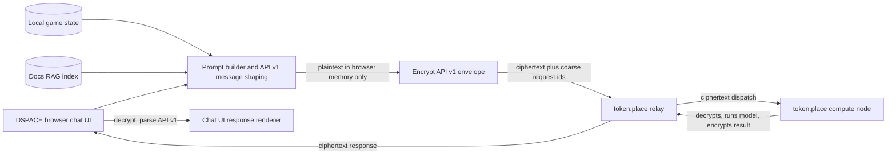
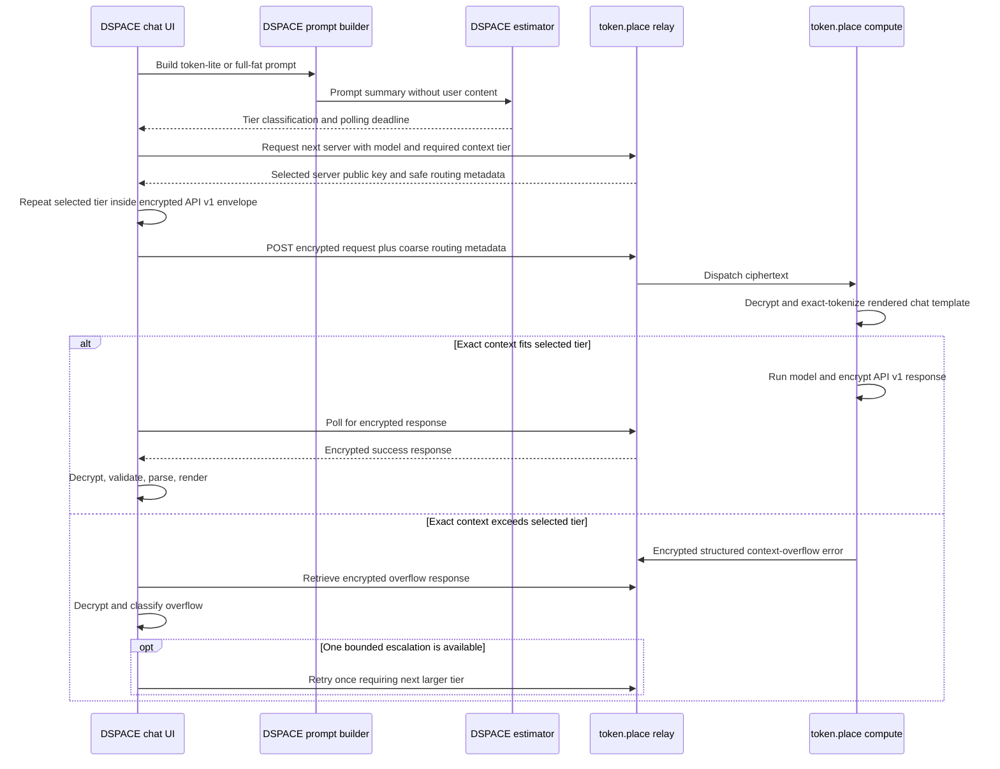

# DSPACE token.place Context Tiers Design

## Purpose

DSPACE chat now has a working token.place API v1 encrypted relay path for small prompts, but the
full DSPACE chat workload needs explicit measurement, conservative estimation, tier-aware routing,
and compute-side validation before it can reliably include system instructions, docs-RAG context,
player state, and chat history.

This document defines DSPACE's responsibilities for benchmarking, estimating, routing, and
validating full-fat DSPACE chat through token.place context tiers. It also names the corresponding
token.place responsibilities so later implementation prompts can keep DSPACE changes focused and
avoid designing API v2.

## Non-goals

- Do not design, depend on, or modify token.place API v2.
- Do not add streaming to API v1. DSPACE's token.place API v1 flow remains non-streaming.
- Do not make relays plaintext-aware. Relay-visible request data must stay ciphertext-only plus
  coarse, privacy-safe routing metadata.
- Do not replace compute-side exact admission with browser estimates. DSPACE estimates are routing
  hints and UX safeguards; compute nodes remain authoritative after decryption.
- Do not silently truncate full-fat prompts after compute-side rejection unless a separate design
  defines the truncation policy and surfaces it clearly to the user.
- Do not record user prompt text, docs excerpts, player state, keys, ciphertext, or decrypted
  responses in logs, telemetry, benchmark outputs, or test artifacts.
- Do not modify application behavior in this planning document.

## Repository context and current state

The existing DSPACE token.place integration is documented in
[`docs/design/token-place-chat-v3.1.md`](token-place-chat-v3.1.md). The current client utility is
`frontend/src/utils/tokenPlace.js`, which exposes token.place API v1 helpers including
`TokenPlaceChatV2`, `tokenPlaceChat`, encryption helpers, response validation, prompt resolution,
and API v1 message shaping. The full DSPACE prompt builder remains in
`frontend/src/utils/openAI.js` as `buildChatPrompt()`, including system instructions, docs-RAG
context, player-state snapshots, and chat-history composition.

DSPACE staging `main-0dd9127` successfully completed token.place API v1 E2EE chat with token-lite
enabled. That staging result proves the end-to-end small-prompt path works:

1. DSPACE constructs an API v1 chat request.
2. DSPACE selects a token.place relay/compute server.
3. DSPACE encrypts the request for the compute node.
4. token.place compute decrypts and processes the API v1 request.
5. DSPACE retrieves the encrypted response.
6. DSPACE decrypts the response.
7. DSPACE parses API v1 response shape.
8. DSPACE renders the assistant response in the chat UI.

The remaining blocker is not the basic E2EE relay path. The blocker is context capacity and
workload routing for full-fat prompts that may include system instructions, RAG context, player
state, and chat history.

Current DSPACE API v1 message shaping limits are:

| Limit | Current value | Notes |
| --- | ---: | --- |
| Maximum API v1 messages | 64 | Sanitized before encryption. |
| Maximum characters per message content | 32,768 | Long messages are chunked or excluded by current shaping. |
| Maximum total message-content characters | 131,072 | Across all API v1 message `content` fields. |

The 131,072-character ceiling is roughly 32K tokens under the common four-characters-per-token
heuristic. That is only a rough browser-side estimate. It is not an exact tokenizer result, does not
include chat-template overhead, and does not reserve tokens for the model output. Therefore a prompt
that satisfies DSPACE's current API v1 character ceiling can still exceed an 8K context runtime and
may also exceed a 64K runtime after exact tokenization and output reservation.

Initial token.place service profiles are expected to be:

| Tier ID | Total context tokens | Intended use |
| --- | ---: | --- |
| `8k-fast` | 8,192 | Small, low-latency requests; token-lite should normally fit here. |
| `64k-full` | 65,536 | Full-fat DSPACE prompts and RAG-heavy requests. |

DSPACE should prefer the smallest tier likely to satisfy the request. token-lite should normally
route to `8k-fast`; full-fat prompts may require `64k-full`.

## Phase 0 estimator implementation

The Phase 0 token.place context-tier work adds a deterministic browser-side estimator in
`frontend/src/utils/tokenPlaceContextEstimator.js`. It is a conservative heuristic, not an exact
Llama tokenizer:

- It operates on the complete sanitized token.place API v1 message payload, after DSPACE's existing
  message shaping has normalized roles, chunked long system messages, and enforced API v1 message
  limits.
- It counts UTF-8 bytes for message roles and content with `TextEncoder`; it does not rely on
  JavaScript UTF-16 string length alone.
- It estimates prompt tokens as `ceil(payloadUtf8Bytes / 3)` plus fixed chat-template overhead
  (`16` tokens per chat plus `8` tokens per message). The byte divisor is intentionally more
  conservative than the common four-characters-per-token rule and remains fully offline.
- It reserves `512` output tokens by default, matching the current DSPACE/token.place expected
  response budget used by the context benchmark.
- It adds a documented safety margin of the larger of `256` tokens or `8%` of estimated prompt
  tokens. Callers may override the output reservation or safety-margin tokens in tests and future
  routing code.
- It returns a structured result with estimated prompt tokens, reserved output tokens,
  safety-margin tokens, estimated total tokens, selected tier, over-limit status, payload UTF-8
  bytes, message count, per-message byte summaries, and the deterministic estimator version.

Tier selection is pure and deterministic: select `8k-fast` only when prompt estimate plus output
reservation plus safety margin fits `8,192`; otherwise select `64k-full` only when it fits `65,536`;
otherwise return `selectedTier: null` and `overLimit: true`. The estimator never truncates and never
sends prompt text to a server.

The Phase 0 benchmark now includes estimator output for synthetic fixtures and a calibration section.
When a lightweight development-only exact Llama 3.1 tokenizer hook is available, the benchmark can
record prompt-token error; otherwise it reports calibration as unavailable and keeps production
estimation explicitly heuristic.

## Current-state architecture



Current token-lite staging validates this path for small requests. Full-fat requests need tier
selection before relay dispatch and exact context admission after compute decrypts the request.

## Proposed request sequence



## Phase roadmap

### Phase 0: Measurement and instrumentation

Goal: measure real DSPACE prompt composition without recording prompt text.

DSPACE should capture a deterministic prompt summary for token-lite and full-fat prompt builds:

- API v1 message count.
- UTF-16 JavaScript character count per component and total message content.
- UTF-8 byte count per component and total message content.
- Conservative estimated tokens per component and total.
- Component-level contribution, for example:
  - base system instructions;
  - persona or NPC instructions;
  - docs-RAG excerpts;
  - player state;
  - chat history;
  - latest user turn;
  - chat-template overhead estimate;
  - reserved output tokens;
  - safety margin.
- Prompt-build time.
- RAG lookup time.
- Encryption time.
- Queue/retrieval time.
- End-to-end latency.
- Selected tier, if routing is enabled.
- Safe request id and safe error code, if any.

Representative benchmark scenarios:

| Scenario | Purpose |
| --- | --- |
| token-lite baseline | Confirms small prompt behavior and `8k-fast` fit. |
| Minimal new-game state | Measures a fresh full-fat chat with little save data. |
| Typical mid-game state | Represents common player state, inventory, quests, and docs-RAG. |
| RAG-heavy state | Exercises large docs excerpts and source merging. |
| Long chat history | Exercises accumulated user/assistant messages. |
| Large player-state payload | Exercises save snapshots, inventory, completed quests, and process state. |
| Near-DSPACE API character ceiling | Exercises current 64-message, 32,768-character, and 131,072-total-character boundaries. |

Benchmark outputs should be local artifacts that are safe to inspect and easy to delete:

- JSON output for programmatic comparison, for example
  `artifacts/benchmarks/token-place-context/<timestamp>.json`.
- Markdown summaries for humans, for example
  `artifacts/benchmarks/token-place-context/<timestamp>.md`.
- Outputs must not be committed when they contain runtime measurements or user-derived counts.
- Fixtures used by committed tests must be synthetic or deterministic repository fixtures.

### Phase 1: Two static physical tiers

Goal: ship predictable tier routing with exactly one warmed runtime per operator.

Initial physical target mapping:

| Hardware | Target tier | Notes |
| --- | --- | --- |
| Mac Mini M4 Pro with 24 GB unified memory | `8k-fast` | Small, fast requests and token-lite. |
| Windows PC with RTX 4090 24 GB VRAM and 128 GB DDR5 | `64k-full` | Full-fat prompts and larger context. |

Operational constraints:

- Context tier is selected manually before starting the token.place operator.
- A compute node warms exactly one selected tier before registration.
- Switching tiers requires stopping the operator, changing the tier, warming the new runtime, and
  re-registering.
- DSPACE estimates the required tier before selecting a node.
- Compute nodes enforce the exact context budget after decrypting and exactly tokenizing the
  rendered prompt.
- A structured encrypted context-overflow error may trigger one retry from `8k-fast` to
  `64k-full`.
- DSPACE must not retry automatically for policy errors, network errors, malformed responses, or
  general provider failures.

DSPACE responsibilities in Phase 1:

1. Build a privacy-safe prompt summary in browser memory.
2. Estimate required context with output-token reservation and safety margin.
3. Select the smallest likely tier.
4. Ask token.place for a node matching the selected tier.
5. Repeat the selected tier inside the encrypted API v1 request so compute can compare requested
   routing with its own profile.
6. Use tier-aware polling deadlines.
7. Retry once only when a decrypted, structured context-overflow response indicates a larger tier
   may satisfy the request.

### Phase 2: Capability-aware and load-aware routing

Goal: route by service capability instead of raw hardware identity.

token.place responsibilities:

- Nodes advertise derived service capabilities, not raw hardware identity.
- Capabilities include model availability and context tiers such as `8k-fast` and `64k-full`.
- Relay selection filters by requested model and required context tier.
- Scheduler prefers the smallest capable tier, then the least-loaded eligible node.
- Queue depth, in-flight work, and max concurrency influence selection.
- Small work may spill to a larger tier only when no smaller eligible node is available.

DSPACE responsibilities:

- Provide the desired model and minimum required context tier as coarse routing metadata.
- Keep routing metadata privacy-safe and content-free.
- Continue embedding detailed prompt content only in the encrypted envelope.
- Treat returned node capability metadata as advisory until the compute node admits the exact
  decrypted prompt.

### Phase 3: Runtime optimization

Goal: empirically tune runtimes after correctness and privacy boundaries are stable.

Benchmark variables:

- Flash attention on/off.
- f16, q8, and q4 KV cache options.
- `offload_kqv` behavior.
- `n_batch` and `n_ubatch`.
- Prompt caching.
- Backend-specific behavior on Metal, CUDA, and any token.place-supported runtime.

Metrics:

- Peak and steady memory usage.
- Prefill throughput.
- Decode throughput.
- Time to first token or first complete non-streaming response.
- Total latency.
- Queue time.
- Output quality regressions for representative DSPACE prompts.

Planning note: a 64K f16 KV cache for Llama 3.1 8B GQA may consume roughly 8 GB before model
weights and runtime buffers. This is a planning estimate only; Google AI answers and
rule-of-thumb memory estimates are not sufficient for admission. token.place compute must verify
runtime behavior empirically and enforce exact context budgets.

### Phase 4: Same-device multi-tier research

Goal: investigate whether one operator can serve multiple tiers on the same device without
sacrificing reliability.

Future investigations, not part of the initial implementation:

- Multiple high-level `Llama` instances.
- One shared model with multiple low-level llama.cpp contexts.
- llama-server sidecar with slots, continuous batching, prompt caching, metrics, and speculative
  decoding.
- Dynamic tier switching or context eviction based on available memory.
- Admission models that account for live memory pressure and queue state.

## DSPACE-side contract

### Prompt summary structure

DSPACE should produce a deterministic summary that never contains user content:

```json
{
  "schemaVersion": 1,
  "client": "dspace",
  "promptMode": "full-fat",
  "model": "llama-3.1-8b-instruct",
  "messageCount": 12,
  "contentChars": 18420,
  "contentUtf8Bytes": 19105,
  "components": [
    {
      "id": "system",
      "messageCount": 1,
      "contentChars": 3200,
      "contentUtf8Bytes": 3200,
      "estimatedTokens": 900
    },
    {
      "id": "docs_rag",
      "messageCount": 3,
      "contentChars": 7200,
      "contentUtf8Bytes": 7390,
      "estimatedTokens": 2100
    }
  ],
  "estimate": {
    "estimatedPromptTokens": 6100,
    "reservedOutputTokens": 1024,
    "chatTemplateOverheadTokens": 256,
    "safetyMarginTokens": 768,
    "estimatedTotalContextUse": 7892
  },
  "classification": {
    "selectedTier": "8k-fast",
    "estimatedPromptTokens": 6100,
    "reservedOutputTokens": 1024,
    "safetyMarginTokens": 768,
    "estimatedTotalContextUse": 7892,
    "overLimit": false,
    "reason": "fits"
  },
  "timingMs": {
    "promptBuild": 42,
    "rag": 18,
    "encryption": 0,
    "queueRetrieval": 0,
    "endToEnd": 0
  }
}
```

Rules:

- `components[].id` must be an enum, not a title or excerpt.
- Component summaries must contain counts and durations only.
- Do not include message text, RAG excerpts, player state, keys, ciphertext, decrypted responses,
  or user-specific raw values.
- Request ids are allowed only when they are random correlation identifiers and not derived from
  prompt content.

### Browser-safe conservative token estimate

DSPACE's browser estimate should be deterministic and conservative:

```text
estimatedPromptTokens = max(
  ceil(totalUtf8Bytes / bytesPerTokenAssumption),
  ceil(totalContentChars / charsPerTokenAssumption)
) + chatTemplateOverheadTokens

estimatedTotalContextUse =
  estimatedPromptTokens + reservedOutputTokens + safetyMarginTokens
```

Suggested initial assumptions:

| Parameter | Initial value | Rationale |
| --- | ---: | --- |
| `charsPerTokenAssumption` | 4 | Common rough heuristic. |
| `bytesPerTokenAssumption` | 4 | Helps account for non-ASCII UTF-8 expansion. |
| `chatTemplateOverheadTokens` | `messageCount * 8 + 64` | Conservative placeholder until exact tokenizer fixtures exist. |
| `reservedOutputTokens` | 1,024 for full-fat, 512 for token-lite | Prevents consuming the full context with prompt tokens. |
| `safetyMarginTokens` | max(512, ceil(estimatedPromptTokens * 0.10)) | Buffers tokenizer mismatch and template overhead. |

The exact constants should be calibrated against compute-side tokenizer measurements from Phase 0
and Phase 3. DSPACE should treat estimates near a boundary as belonging to the larger tier.

### Tier classification result

Every request should have a classification result before node selection:

```ts
type ContextTierId = '8k-fast' | '64k-full';

type TierClassification = {
    selectedTier: ContextTierId | null;
    estimatedPromptTokens: number;
    reservedOutputTokens: number;
    safetyMarginTokens: number;
    estimatedTotalContextUse: number;
    overLimit: boolean;
    reason?: 'fits' | 'exceeds-all-tiers' | 'invalid-input';
};
```

### Tier-selection decision table

| Estimated total context use | Selected tier | DSPACE behavior |
| ---: | --- | --- |
| `<= 8,192` and not boundary-risky | `8k-fast` | Request an `8k-fast` node. |
| `> 8,192` and `<= 65,536` | `64k-full` | Request a `64k-full` node. |
| Boundary-risky near 8K after safety margin | `64k-full` | Prefer larger tier to avoid likely overflow. |
| `> 65,536` | none | Surface a user-visible over-limit state before dispatch, unless a future truncation design exists. |
| Invalid or empty prompt after shaping | none | Use existing validation/error handling; do not dispatch malformed API v1. |

### Request routing and encrypted request contents

Relay-visible routing may include:

- API version.
- Safe request id.
- Required model id.
- Required context tier id.
- Optional prompt size bucket, for example `small`, `medium`, `large`, or `over_8k`.
- Client name/version when it contains no user content.

Relay-visible routing must not include:

- Prompt text.
- Exact tokenized content.
- RAG excerpts.
- Player state.
- Chat history text.
- Keys other than public keys required by the E2EE protocol.
- Ciphertext in logs or diagnostics beyond existing opaque queue storage requirements.

The selected tier must also be repeated inside the encrypted API v1 request envelope, for example
under safe request options or metadata that only compute can read. This lets compute detect routing
mismatch after decryption without exposing details to the relay.

### Polling deadlines and bounded retry

DSPACE should set context-aware polling deadlines:

| Tier | Suggested initial deadline | Notes |
| --- | ---: | --- |
| `8k-fast` | 5,000 ms | Small prompts should fail fast when the node is unavailable. |
| `64k-full` | 30,000 ms | Larger prefill and queue times are expected; tune from Phase 0 measurements. |

Retry policy:

- Retry at most once.
- Retry only when DSPACE decrypts a structured context-overflow response from compute.
- Retry only from `8k-fast` to `64k-full`.
- Preserve a clear UI state so the user knows the request is being escalated.
- Do not retry automatically for policy errors, network errors, malformed responses, quota/rate
  limits, provider errors, decryption failures, or generic timeouts.
- Do not silently truncate after compute-side rejection unless separately designed and surfaced.

## Privacy and observability requirements

Never log or persist:

- Message text.
- RAG excerpts.
- Player state.
- Save-game payloads.
- Public/private key material beyond protocol-required transient public-key routing.
- Ciphertext bodies.
- Decrypted responses.
- Exact tokenized content.

Telemetry may contain:

- Counts, sizes, and durations.
- Tier ids.
- Safe error codes.
- Random request ids.
- Aggregate prompt-size buckets.
- Queue and latency metrics.

Production instrumentation must be opt-in or emitted only through existing privacy-safe diagnostics.
Benchmark fixtures must be synthetic or deterministic repository fixtures. Local benchmark outputs
must not be committed when they are generated from real play sessions.

## Benchmark schema

```json
{
  "schemaVersion": 1,
  "generatedAt": "2026-06-22T00:00:00.000Z",
  "scenario": "typical-mid-game",
  "source": "synthetic-fixture",
  "client": {
    "name": "dspace",
    "build": "local"
  },
  "request": {
    "promptMode": "full-fat",
    "model": "llama-3.1-8b-instruct",
    "messageCount": 12,
    "contentChars": 18420,
    "contentUtf8Bytes": 19105,
    "componentCounts": [
      {
        "id": "player_state",
        "messageCount": 1,
        "contentChars": 5200,
        "contentUtf8Bytes": 5400,
        "estimatedTokens": 1500
      }
    ]
  },
  "classification": {
    "selectedTier": "8k-fast",
    "estimatedPromptTokens": 6100,
    "reservedOutputTokens": 1024,
    "safetyMarginTokens": 768,
    "estimatedTotalContextUse": 7892,
    "overLimit": false
  },
  "timingMs": {
    "promptBuild": 42,
    "rag": 18,
    "encryption": 7,
    "queueRetrieval": 1200,
    "endToEnd": 1850
  },
  "result": {
    "status": "success",
    "safeErrorCode": null,
    "retryCount": 0
  }
}
```

## Failure-mode table

| Failure mode | Where detected | DSPACE behavior | Retry? | User-facing result |
| --- | --- | --- | --- | --- |
| Browser estimate exceeds all tiers | DSPACE estimator | Do not dispatch. | No | Explain that the request is too large. |
| No node for selected tier | Relay selection | Surface capacity/unavailable state. | No automatic tier retry unless smaller tier was selected and larger tier is explicitly eligible. | Ask user to retry later. |
| Exact context overflow on `8k-fast` | Compute after decrypt/tokenize | Decrypt structured overflow response and escalate once to `64k-full`. | Yes, once | Show escalation/progress state. |
| Exact context overflow on `64k-full` | Compute after decrypt/tokenize | Stop. Do not truncate silently. | No | Explain that the request exceeds available context. |
| Policy/content error | Compute/API v1 response | Preserve safe structured error summary. | No | Show policy/provider message. |
| Network or relay timeout | Fetch/polling | Abort or surface timeout. | No | Show retry-later message. |
| Malformed encrypted response | DSPACE validation | Reject response. | No | Show provider response error. |
| Decryption failure | DSPACE decrypt step | Reject response; do not log plaintext/ciphertext. | No | Show secure response error. |
| Rate limit or quota | Decrypted API v1 response | Preserve status/type/code safely. | No | Show capacity/quota message. |
| General provider failure | Decrypted API v1 response | Preserve safe summary. | No | Show provider failure message. |

## Acceptance and testing strategy

Unit tests:

- Estimator boundaries around `8k-fast` and `64k-full`.
- Tier selection for token-lite, full-fat, boundary-risky, and over-limit inputs.
- UTF-8-heavy, code-heavy, JSON-heavy, whitespace-heavy, and long-RAG inputs.
- Output-token reservation and safety-margin calculations.
- Prompt-summary serialization rejects or omits content-bearing fields.

E2E and integration tests:

- Mocked `8k-fast` success.
- Mocked `64k-full` success.
- Mocked encrypted `8k-fast` context overflow followed by one successful `64k-full` retry.
- Mocked `64k-full` overflow with no further retry.
- Policy, network, malformed-response, and provider failures do not trigger tier escalation.
- Relay-visible requests remain ciphertext-only plus safe routing metadata.
- The selected tier appears inside the decrypted API v1 request visible only to compute/test helpers.

Staging validation:

- token-lite routes successfully on `8k-fast`.
- Full-fat chat routes successfully on `64k-full`.
- Full-fat boundary cases either route to `64k-full` or surface over-limit before dispatch.
- Verify logs and diagnostics contain counts, durations, tier ids, request ids, and safe error codes
  only.

## Rollout plan

1. Land documentation and implementation prompts.
2. Add Phase 0 measurement behind opt-in diagnostics or local benchmark commands.
3. Collect synthetic and local benchmark data for representative scenarios.
4. Implement browser estimator and classification tests.
5. Add token.place tier metadata support in DSPACE requests after token.place API v1 capability
   registration is available.
6. Enable manual operator tier selection in token.place and validate `8k-fast` token-lite staging.
7. Validate full-fat `64k-full` staging.
8. Enable bounded overflow retry from `8k-fast` to `64k-full`.
9. Expand load-aware routing after token.place advertises queue and concurrency capabilities.

## Rollback plan

- Disable full-fat token.place routing and fall back to token-lite if estimator, routing, or 64K
  admission behavior is unstable.
- Disable tier escalation independently from base tier routing if retry behavior causes confusing UX
  or duplicate work.
- Keep OpenAI user-key fallback behavior separate from token.place tier rollback.
- Keep existing API v1 E2EE token-lite path available as the known-good baseline from staging
  `main-0dd9127`.
- Remove or ignore local benchmark artifacts rather than migrating them.

## Open questions

- What exact safe metadata fields will token.place accept for API v1 capability-aware server
  selection?
- What context-overflow error shape should compute encrypt back to DSPACE, including stable
  `type`, `code`, and optional safe `tier` fields?
- What output-token reservation should DSPACE use for short answers, normal chat, and long
  explanatory responses?
- How close to a tier boundary should DSPACE classify as boundary-risky and select the larger tier?
- Should DSPACE expose a user-visible manual tier override, or should tiering stay automatic?
- What local benchmark artifact directory should be gitignored if it does not already exist?
- Which deterministic repository fixtures best represent full-fat player state without leaking real
  user data?
- How should DSPACE correlate client-side timings with token.place queue timings without exposing
  content-bearing metadata?

## Future work

Long-term issue themes beyond the initial implementation:

- Exact browser tokenizer matching the deployed compute model and chat template.
- llama-server sidecar evaluation for slots, continuous batching, metrics, prompt caching, and
  speculative decoding.
- Multiple warm contexts on one operator for fast tier switching.
- Shared-model contexts using lower-level llama.cpp APIs.
- Dynamic memory-aware tier selection and eviction.
- Advanced scheduling across queue depth, in-flight work, max concurrency, model, and tier.
- Prompt caching for repeated DSPACE system instructions and stable docs context.
- Speculative decoding where it improves non-streaming end-to-end latency without reducing output
  quality.
- API v2 streaming as a separate future design, not part of this API v1 context-tier plan.
