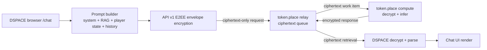

# DSPACE token.place context tiers design

## Purpose

This document defines DSPACE's responsibilities for benchmarking, estimating, routing, and
validating full-fat DSPACE `/chat` requests through token.place API v1 context tiers. It is a
planning document for the P4-P13 sequence and intentionally stays on the DSPACE side of the
contract: DSPACE measures and classifies prompt shape before encryption, chooses a compatible
API v1 relay target, and handles bounded context-overflow retry behavior. token.place remains
responsible for operator registration, relay scheduling, compute-side exact tokenization,
admission control, inference, and encrypted response delivery.

This document is documentation-only and does not change API behavior, application code, tests,
package dependencies, generated files, or API v2 design.

## Non-goals

- Do not design or modify token.place API v2.
- Do not add API v1 streaming; API v1 remains non-streaming for this roadmap.
- Do not send plaintext prompts, RAG excerpts, player state, keys, ciphertext, or decrypted
  responses to DSPACE telemetry.
- Do not make relay-owned token.place services aware of exact prompt text, exact tokenized
  content, player inventory, save data, or decrypted responses.
- Do not rely on browser-side estimates for final admission. Compute nodes are authoritative
  after decryption and exact tokenizer rendering.
- Do not silently truncate prompts after compute-side rejection unless a separate user-visible
  truncation design is approved.
- Do not infer Google AI or rule-of-thumb memory sizing as sufficient for admission decisions;
  empirical benchmarking is required.

## Confirmed current state

DSPACE staging `main-0dd9127` successfully completed token.place API v1 end-to-end encrypted chat
with token-lite enabled. That staging result proves the existing narrow path works across these
boundaries:

1. DSPACE constructs an API v1-compatible request.
2. DSPACE selects a token.place relay/compute target.
3. DSPACE encrypts the request envelope for the selected compute node.
4. token.place relay accepts and queues ciphertext-only request state.
5. token.place compute decrypts, processes, and produces an API v1 response.
6. DSPACE retrieves the encrypted response.
7. DSPACE decrypts, parses API v1 response shape, and renders UI output.

The remaining blocker is not basic API v1 E2EE plumbing. The blocker is context capacity and
workload routing for full-fat prompts that include system instructions, DSPACE RAG context,
player state, and chat history.

Relevant current DSPACE API v1 input ceilings are:

| Limit | Current value | Design implication |
| --- | ---: | --- |
| Maximum API v1 messages | 64 messages | Estimator must report message count and catch near-limit workloads. |
| Maximum characters per message | 32,768 characters | Component summaries must identify oversized individual prompt parts. |
| Maximum total message-content characters | 131,072 characters | Roughly 32K tokens under the common four-characters-per-token heuristic. |

The 131,072-character ceiling is only a rough planning proxy. It does not equal an exact tokenizer
result and does not include chat-template overhead, tool/schema overhead if later added, or output
token reservation.

## Initial context profiles

DSPACE should prefer the smallest tier likely to satisfy a request while preserving a safety margin
and output reservation. Initial token.place profiles are:

| Tier ID | Total context tokens | Expected DSPACE fit | Notes |
| --- | ---: | --- | --- |
| `8k-fast` | 8,192 | token-lite baseline and small chat turns | Optimized for low-latency short prompts. |
| `64k-full` | 65,536 | full-fat DSPACE prompts with RAG, state, and history | Required for large state or RAG-heavy prompts. |

The compute node remains the authoritative admission controller. DSPACE estimates and classifies
before encryption; the compute node decrypts, renders the prompt with the exact chat template,
exactly tokenizes, reserves output capacity according to provider policy, and either admits or
returns a structured encrypted overflow error.

Relay-visible routing information must stay coarse and privacy-safe. The relay may receive safe
routing metadata such as requested model, required tier ID, request ID, queue hints, and aggregate
sizes if approved. It must not receive prompt text or exact tokenized content.

## Current-state architecture



Today this flow is proven for token-lite. Full-fat operation needs DSPACE-side measurement,
conservative tier classification, tier-aware server selection, context-aware polling deadlines,
and one bounded retry path for context overflow.

## Proposed request sequence

```mermaid
sequenceDiagram
    participant UI as DSPACE /chat UI
    participant PB as Prompt builder
    participant EST as Estimator/classifier
    participant RELAY as token.place relay
    participant CN as token.place compute

    UI->>PB: Build full-fat messages in browser memory
    PB->>EST: Prompt summary without user content
    EST-->>UI: selectedTier, estimate, reservation, margin
    UI->>RELAY: GET /api/v1/relay/servers/next?model=...&tier=selectedTier
    RELAY-->>UI: compute public key + safe node metadata
    UI->>UI: Repeat selected tier inside encrypted API v1 request
    UI->>RELAY: POST /api/v1/relay/requests with ciphertext + coarse routing metadata
    RELAY->>CN: Deliver ciphertext work item
    CN->>CN: Decrypt, render chat template, exact tokenize, admit or reject
    alt admitted
        CN-->>RELAY: encrypted API v1 success response
        UI->>RELAY: Poll response retrieval using context-aware deadline
        RELAY-->>UI: encrypted response
        UI->>UI: Decrypt, validate, parse, render
    else structured context overflow and selectedTier == 8k-fast
        CN-->>RELAY: encrypted context_overflow response
        UI->>RELAY: Retrieve overflow response
        UI->>RELAY: Retry once against 64k-full with same plaintext rebuilt locally
    else policy/network/malformed/provider failure or overflow after retry
        CN-->>RELAY: encrypted or surfaced failure
        UI-->>UI: Show user-visible error; no automatic retry
    end
```

## DSPACE-side contract

DSPACE must provide the following deterministic, privacy-preserving contract before dispatching a
full-fat token.place request:

1. **Prompt summary without content.** Produce a deterministic prompt-summary object that never
   contains user message text, RAG excerpts, player-state values, raw inventory, save data,
   secrets, ciphertext, or decrypted responses.
2. **Browser-safe conservative estimate.** Estimate tokens from character and UTF-8 byte counts
   using a conservative browser-safe heuristic until an exact browser tokenizer is available.
3. **Output reservation.** Reserve output tokens before classification. The reservation should be
   configurable by DSPACE chat mode and conservative enough to avoid admitting a prompt that leaves
   no room for the assistant response.
4. **Safety margin.** Apply a safety margin to cover chat-template overhead, tokenizer variance,
   role separators, metadata, and envelope-specific rendering differences.
5. **Tier classification result.** Return a classification object with:
   - `selectedTier`;
   - `estimatedPromptTokens`;
   - `reservedOutputTokens`;
   - `safetyMarginTokens`;
   - `estimatedTotalContextUse`;
   - `overLimit` and `overLimitReason` when no configured tier is likely to fit.
6. **Tier-aware server selection.** Request a relay server capable of the selected model and tier.
7. **Encrypted tier echo.** Repeat the selected tier inside the encrypted API v1 request so compute
   can validate that the routing hint matches the client intent.
8. **Context-aware polling.** Use polling deadlines appropriate to the tier and expected workload;
   large 64K prefill should not inherit the shortest token-lite timeout.
9. **Bounded retry.** Retry automatically at most once, only when DSPACE decrypts a structured
   context-overflow response and the original request targeted `8k-fast` while `64k-full` is
   available.
10. **No broad retries.** Do not automatically retry for policy failures, network errors,
    malformed responses, rate limits, general provider failures, or overflow from `64k-full`.
11. **No silent truncation.** Do not silently remove RAG, history, or player-state content after a
    compute-side rejection unless a separately designed truncation policy is implemented and
    surfaced to the user.

## Deterministic prompt-summary structure

Example schema for DSPACE-local measurement and safe diagnostics:

```json
{
  "schemaVersion": 1,
  "requestId": "safe-local-request-id",
  "chatMode": "token-lite|full-fat",
  "model": "llama-3.1-8b-instruct",
  "messageCount": 12,
  "totalCharacters": 18420,
  "totalUtf8Bytes": 19602,
  "maxMessageCharacters": 4096,
  "components": [
    {
      "name": "system-instructions",
      "messageIndexes": [0],
      "characters": 2400,
      "utf8Bytes": 2410,
      "estimatedTokens": 700
    },
    {
      "name": "docs-rag",
      "messageIndexes": [3, 4],
      "characters": 8200,
      "utf8Bytes": 8400,
      "estimatedTokens": 2400
    }
  ],
  "estimate": {
    "heuristic": "max(chars/4, utf8Bytes/3)",
    "estimatedPromptTokens": 6200,
    "reservedOutputTokens": 1024,
    "safetyMarginTokens": 512,
    "estimatedTotalContextUse": 7736,
    "selectedTier": "8k-fast",
    "overLimit": false
  },
  "durationsMs": {
    "promptBuild": 42,
    "rag": 18,
    "encryption": 9,
    "queueAndRetrieval": 1200,
    "endToEnd": 1360
  }
}
```

The values are illustrative. The committed schema and tests should assert absence of raw content,
not just absence of obvious field names.

## Benchmark schema and outputs

Phase 0 should define local benchmark outputs that can be generated during development without
committing user content. Recommended files are local artifacts such as
`artifacts/token-place-context/benchmarks.json` and `artifacts/token-place-context/benchmarks.md`,
or another ignored output directory chosen during implementation.

Benchmark records should contain:

| Field | Type | Privacy requirement |
| --- | --- | --- |
| `schemaVersion` | integer | Safe. |
| `scenarioId` | string | Synthetic fixture ID only. |
| `timestamp` | ISO string | Safe if local; aggregate in production. |
| `chatMode` | string | Safe tier/input class. |
| `messageCount` | integer | Safe aggregate. |
| `totalCharacters` | integer | Safe aggregate. |
| `totalUtf8Bytes` | integer | Safe aggregate. |
| `maxMessageCharacters` | integer | Safe aggregate. |
| `estimatedPromptTokens` | integer | Safe estimate. |
| `reservedOutputTokens` | integer | Safe estimate. |
| `safetyMarginTokens` | integer | Safe estimate. |
| `estimatedTotalContextUse` | integer | Safe estimate. |
| `selectedTier` | string | Safe tier ID. |
| `componentContributions` | array | Component names and counts only; no content. |
| `durationsMs` | object | Counts and timings only. |
| `safeErrorCode` | string/null | Coarse, non-content error codes only. |

Representative benchmark scenarios:

- `token-lite-baseline`: current known-good token-lite request.
- `minimal-new-game-state`: fresh user, minimal save/player state.
- `typical-mid-game-state`: representative inventory, quest, and process progress.
- `rag-heavy-state`: many docs-RAG chunks selected.
- `long-chat-history`: maximum useful conversation history before pruning policy.
- `large-player-state-payload`: large but valid save/player-state snapshot.
- `near-dspace-api-character-ceiling`: synthetic input near 64 messages, 32,768 characters per
  message, and 131,072 total message-content characters.

Benchmark fixtures must be synthetic or deterministic repository fixtures. They must not capture
real user content.

## Tier-selection decision table

Assume `estimatedTotalContextUse = estimatedPromptTokens + reservedOutputTokens +
safetyMarginTokens`.

| Condition | Selected tier | Automatic behavior |
| --- | --- | --- |
| `estimatedTotalContextUse <= 8,192` | `8k-fast` | Prefer smallest likely tier. |
| `8,192 < estimatedTotalContextUse <= 65,536` | `64k-full` | Route directly to full tier. |
| `estimatedTotalContextUse > 65,536` | none | Mark over limit before dispatch; show user-visible error or future truncation UI. |
| Estimate fits `8k-fast`, compute returns structured overflow | `64k-full` retry | Retry once if 64K node is available. |
| Estimate fits `64k-full`, compute returns structured overflow | none | No automatic retry; show context-capacity failure. |
| Any policy/network/malformed/general provider failure | unchanged | No tier escalation retry. |
| `8k-fast` eligible nodes unavailable and 64K eligible nodes available | `64k-full` spill | Allowed only as scheduler policy for small work when no smaller eligible node exists. |

## Phase 0: Measurement and instrumentation

Goals:

- Measure real DSPACE prompt composition without recording prompt text.
- Add local-only benchmark tooling and privacy-safe diagnostics hooks before changing routing.
- Establish token-lite and full-fat baseline distributions.

DSPACE should capture:

- message count;
- total character count;
- UTF-8 byte count;
- estimated tokens;
- component-level contribution for system instructions, RAG, player state, chat history, and user
  turn;
- prompt-build time;
- RAG time;
- encryption time;
- queue/retrieval time;
- end-to-end latency.

Production instrumentation must be opt-in or emitted only through existing privacy-safe
diagnostics. Local benchmark JSON and Markdown outputs must not include user content and should not
be committed when generated from real sessions.

## Phase 1: Two static physical tiers

Initial physical operators:

| Hardware | Target tier | Operating model |
| --- | --- | --- |
| Mac Mini M4 Pro with 24 GB unified memory | `8k-fast` | Low-latency token-lite and small prompts. |
| Windows PC with RTX 4090 24 GB VRAM and 128 GB DDR5 | `64k-full` | Full-fat DSPACE prompts and large contexts. |

Phase 1 constraints:

- Context tier is selected manually before starting the token.place operator.
- A compute node warms exactly one selected tier before registration.
- Switching tiers requires stopping the operator, changing the tier, warming the new runtime, and
  re-registering.
- DSPACE estimates a tier before selecting a node.
- Compute nodes enforce the exact context budget after decryption.
- A structured encrypted overflow error may trigger one retry from `8k-fast` to `64k-full`.

## Phase 2: Capability-aware and load-aware routing

Phase 2 moves from static routing to derived service capabilities:

- Nodes advertise derived service capabilities rather than raw hardware identity.
- Relay selection filters by model and required context tier.
- The scheduler prefers the smallest capable tier, then the least-loaded node.
- Queue depth, in-flight work, and max concurrency influence selection.
- Small work may spill to a larger tier only when no smaller eligible node is available.

DSPACE's responsibility remains privacy-safe classification and coarse tier hints. token.place owns
operator registration, capability derivation, queue state, and scheduler implementation.

## Phase 3: Runtime optimization

Phase 3 benchmarks runtime settings and backend-specific behavior:

- flash attention;
- f16, q8, and q4 KV cache;
- `offload_kqv`;
- `n_batch`;
- `n_ubatch`;
- prompt caching;
- backend-specific behavior across Metal, CUDA, and llama.cpp/server modes.

Metrics:

- memory use;
- prefill throughput;
- decode throughput;
- time to first token or first non-streaming response;
- total latency;
- output quality.

Planning estimate to record but empirically verify: a 64K f16 KV cache for Llama 3.1 8B GQA may
consume roughly 8 GB before model weights and runtime buffers. This number is not an admission
rule. Actual admission must come from exact tokenizer/rendering plus measured runtime memory.

## Phase 4: Same-device multi-tier research

Future investigations, not initial implementation:

- Multiple high-level `Llama` instances on the same device.
- One shared model with multiple low-level llama.cpp contexts.
- `llama-server` sidecar with slots, continuous batching, prompt caching, metrics, and
  speculative decoding.
- Dynamic tier switching or eviction based on available memory.

These options should be evaluated only after static tiers and capability-aware routing are stable.

## Failure modes

| Failure mode | Where detected | User-visible behavior | Retry? | Privacy invariant |
| --- | --- | --- | --- | --- |
| Estimate exceeds 64K | DSPACE before encryption | Explain prompt is too large for configured tiers. | No | No plaintext leaves browser. |
| No eligible node for selected tier | Relay selection | Show temporary capacity/unavailable message. | Optional manual resend only. | Relay sees tier/model only. |
| Compute exact-token overflow on `8k-fast` | DSPACE after decrypting structured error | Retry once on `64k-full` if available. | Once | Overflow response is encrypted. |
| Compute exact-token overflow on `64k-full` | DSPACE after decrypting structured error | Show capacity failure. | No | Overflow response is encrypted. |
| Content policy failure | Compute/provider response | Show policy-safe error summary. | No | Do not log prompt or response. |
| Network timeout | Browser fetch/polling | Show retry affordance. | No automatic tier retry. | Do not add plaintext diagnostics. |
| Malformed encrypted response | DSPACE validation | Show provider/response error. | No | Do not log decrypted payload. |
| Relay receives plaintext by bug | Test/monitoring | Block release; security regression. | N/A | Relay-visible requests must be ciphertext-only. |

## Privacy and observability requirements

Never log or persist:

- message text;
- RAG excerpts;
- player-state values or raw save data;
- keys;
- ciphertext;
- decrypted responses;
- OpenAI keys or token.place credentials.

Telemetry may contain only:

- counts;
- durations;
- tier IDs;
- safe error codes;
- request IDs suitable for correlation;
- aggregate sizes.

Production instrumentation must be opt-in or emitted only through existing privacy-safe
diagnostics. Benchmark fixtures must be synthetic or deterministic repository fixtures.

## Acceptance and testing strategy

Implementation phases should include:

- Unit tests for estimator boundaries and tier selection.
- Unit tests for UTF-8-heavy, code-heavy, JSON-heavy, whitespace-heavy, and long-RAG inputs.
- E2E tests with mocked `8k-fast` and `64k-full` compute-node responses.
- Staging validation for token-lite on `8k-fast` and full-fat chat on `64k-full`.
- Verification that relay-visible requests remain ciphertext-only with no plaintext messages,
  RAG, player state, keys, or decrypted response content.
- Verification that retry is bounded to one tier escalation and only for structured
  context-overflow responses.

Documentation verification for this design should run repository documentation and link checks
when available, plus `git diff --check`.

## Rollout plan

1. Land this design document.
2. Add Phase 0 local measurement and synthetic benchmark fixtures with privacy assertions.
3. Add estimator and tier-classification unit tests without changing production routing.
4. Gate Phase 1 routing behind a feature flag or staged deployment config.
5. Validate token-lite on `8k-fast` in staging.
6. Validate full-fat chat on `64k-full` in staging.
7. Enable bounded overflow retry only after structured encrypted overflow responses are stable.
8. Promote capability-aware routing only after relay and operator registration support derived
   capabilities.

## Rollback plan

- Disable tier-aware routing and return to the known-good token-lite path if full-fat routing
  causes failures.
- Disable automatic overflow retry independently if retry behavior causes duplicate work or user
  confusion.
- Keep OpenAI opt-in behavior and existing provider settings unchanged during this rollout.
- Preserve local benchmark tooling for diagnosis, but turn off production diagnostics if privacy or
  volume concerns appear.
- Do not roll back by sending plaintext prompts to token.place relay routes.

## Open questions

- What exact output-token reservation should DSPACE use for token-lite and full-fat modes?
- Should DSPACE expose a user-facing setting for shorter/faster versus fuller/slower chat, or keep
  tier selection fully automatic?
- What safe routing metadata will token.place accept in API v1 relay server selection and request
  dispatch?
- What exact structured error code should represent compute-side context overflow?
- How should DSPACE present over-limit guidance without encouraging users to reveal private state?
- What aggregate benchmark thresholds should block promotion from staging to production?

## Future work

Long-term themes for follow-up issues:

- Exact browser tokenizer that matches compute-side chat-template rendering.
- `llama-server` sidecar evaluation.
- Multiple warm contexts on one host.
- Shared-model contexts that avoid duplicate model weights.
- Dynamic memory-based tier selection and eviction.
- Advanced scheduling across model, tier, queue depth, concurrency, and historical latency.
- Prompt caching keyed by privacy-safe local identifiers where feasible.
- Speculative decoding for latency reduction.
- API v2 streaming design, explicitly outside this API v1 roadmap.
