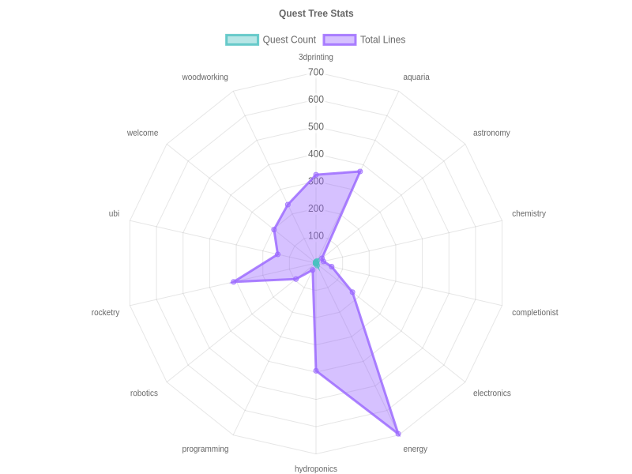

# Quest Trees

DSPACE quests are organized into themed trees that build skills over time. This page summarizes the current quest categories and highlights new trees in development.

## Existing Quest Trees

-   **Welcome** – introductory tutorial showing how to accept and complete quests
-   **3D Printing** – receive a printer, then tackle small projects and larger print runs
-   **Aquaria** – set up a Walstad tank, test the water, install a sponge filter, position the tank, add shrimp, keep guppies, perform water changes, breed them, and graduate to goldfish
-   **Hydroponics** – grow basil, expand to bucket systems, and experiment with lettuce
-   **Electronics** – wire a basic circuit, program an Arduino, and build a dimmer
-   **Robotics** – assemble a line follower and learn servo control after completing electronics basics
-   **Rocketry** – print and launch a model rocket with parachute recovery
-   **Energy** – harvest solar power and accumulate dWatts toward higher milestones
-   **UBI** – an optional quest explaining the metaguild's basic income concept
-   **Completionist** – track progress toward finishing all available quests
-   **Woodworking** – build a sturdy workbench, then craft birdhouses, stools and shelves

## Planned Quest Trees

The following quest lines are being drafted to help achieve the "10x More Quests" goal announced for v3:

-   **Chemistry** – safe experiments that introduce sustainable rocket fuel principles
-   **Astronomy** – observational tasks that prepare players for future rocketry missions
-   **Programming** – simple scripts for automating sensors and data collection

Check back as these new quests are fleshed out and integrated into the main progression.

The above radar chart is updated automatically after pushes to summarize quest volume per tree.
